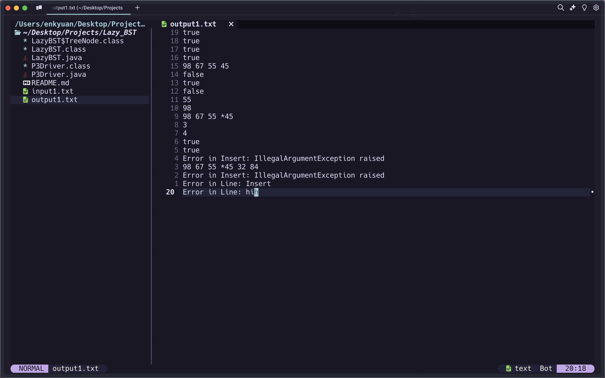

# Lazy Binary Search Tree

## Project Description

This is an implementation of a Binary Search Tree with lazy deletion, where nodes are logically marked as deleted instead of being physically removed. It includes methods to insert, delete, find the minimum and maximum elements, check if an element exists, and print tree nodes.

## Java Version

```shell
openjdk version "23" 2024-09-17
```

## Usage

```shell
javac LazyBST.java
javac P3Driver.java

java P3Driver input1.txt output1.txt
```

> first parameter is a text file with test case and result is outputted to the second parameter

## Sample Output



> output corresponds to sample shell commands to test code

